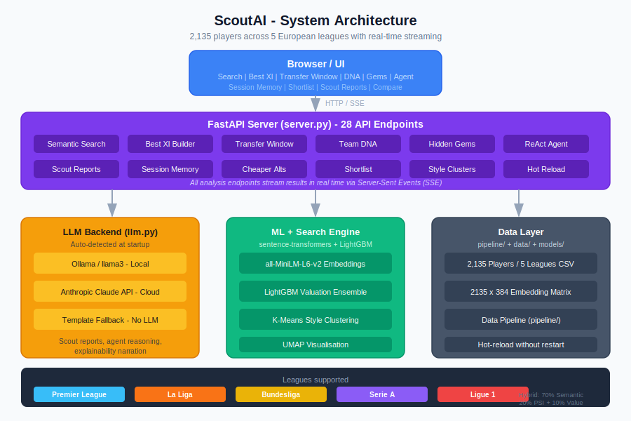

# ScoutAI

Football intelligence platform built for serious scouting. Semantic player search, ML valuation models, constrained squad optimisation, transfer window simulation, and team DNA matching across 2,135 players from five top European leagues with real-time LLM analysis streamed to the browser.

---



---

## What It Does

ScoutAI replaces spreadsheet scouting with a full analytical engine:

1. **Search in plain English** - type "press-resistant midfielder under 25 in the Bundesliga" and get ranked, scored results instantly
2. **Best XI Builder** - optimise a full squad within budget, formation, and age constraints across 6 scoring modes
3. **Transfer Window Planner** - get fee negotiation bands, signing order, and sell recommendations for a given budget
4. **Team DNA Matching** - compute a PSI-weighted tactical identity vector for any club and find stylistic fits across the database
5. **Hidden Gems** - ML-powered value-gap detection ranked by upside, ratio, or efficiency
6. **Cheaper Alternatives** - cosine-similar players within a price ratio target
7. **Scout Reports** - full structured reports with radar charts, valuation model outputs, and streaming LLM narrative
8. **ReAct Agent** - multi-step reasoning agent for complex queries like "find me a young left-back under 30M who can cover the right side"
9. **Session Memory** - stacked preference filters and shortlist management per browser session

---

## Project Structure

```
ScoutAI/
├── server.py                  # FastAPI application, all endpoints and SSE streaming
├── config.py                  # Configuration, paths, model names, league constants
├── llm.py                     # LLM abstraction, auto-detects Ollama or Anthropic
├── data_loader.py             # CSV loading, caching, player serialisation
├── search.py                  # Hybrid semantic + PSI + value search engine
├── embeddings.py              # Sentence-transformer embedding builder and cache
├── normalizer.py              # Cross-league stat normalisation (percentile + difficulty)
├── agent.py                   # ReAct agent with 6 tools and multi-turn reasoning loop
├── memory.py                  # Per-session memory, preference stacking, shortlist
├── report.py                  # Scout report generator, LLM plus template fallback
├── bestxi.py                  # Constrained XI optimiser, 6 modes and 6 formations
├── transfer_window.py         # Transfer window planner, fee model, sell candidates
├── dna.py                     # Team DNA vector, PSI-weighted centroid and cosine ranking
├── templates/
│   └── index.html             # Single-page UI with SSE streaming
├── pipeline/
│   ├── fetch_leagues.py       # Multi-league data ingestion across all 5 leagues
│   ├── fetch_contracts.py     # Contract and valuation data
│   ├── cluster_styles.py      # K-Means style archetype clustering and UMAP
│   ├── train_valuation.py     # LightGBM valuation model training
│   ├── merge_csv.py           # League CSV merge and deduplication
│   └── refresh.py             # Full pipeline runner with hot-reload
├── models/
│   ├── valuation_lgbm.pkl     # LightGBM ensemble base model
│   ├── valuation_lgbm_high.pkl
│   ├── valuation_lgbm_low.pkl
│   └── valuation_meta.json    # Model metadata and feature list
├── data/
│   ├── players_all_leagues.csv  # Main dataset, 2135 players across 5 leagues
│   └── players.csv              # Single-league fallback
├── requirements.txt
├── .env.example
└── ARCHITECTURE.md
```

---

## Feature Set

| Feature | Description |
|---|---|
| Semantic Search | Natural-language query embedded via all-MiniLM-L6-v2 and cosine-ranked with PSI and value boost |
| Hybrid Scoring | 70% semantic + 20% PSI + 10% value gap with stat-boost keywords shifting weights dynamically |
| Best XI | Greedy position-fill optimiser across 6 modes: PSI, Value, Future, Young, Transfer, Balanced |
| Transfer Window | Fee negotiation model with opening bid, expected fee, and walk-away bands. Urgency-ordered signing sequence |
| Team DNA | PSI-weighted embedding centroid for a squad, cosine-ranked across all external players |
| Hidden Gems | future_value minus market_value ranked by gap, multiplier, or PSI efficiency |
| Cheaper Alts | Same-position cosine-similar players within a configurable price ratio |
| Scout Report | Radar chart data, fee model, LLM narrative stream, structured value and verdict sections |
| ReAct Agent | Multi-turn Thought/Action/Observation loop with 6 tools and fallback handling |
| Session Memory | Stacked filter preferences, text qualifiers, shortlist per browser session |
| Style Clusters | K-Means archetypes (Poacher, Playmaker, Sweeper CB, etc.) and UMAP scatter plot |
| Season Progression | Per-season stat history for any player |
| Squad Heatmap | Full squad ranked by position and PSI |
| Valuation Model | LightGBM ensemble (low/base/high) trained on performance and contract features |

---

## Leagues and Data

| League | ID | Color |
|---|---|---|
| Premier League | EPL | Sky blue |
| La Liga | La Liga | Orange |
| Bundesliga | Bundesliga | Gold |
| Serie A | Serie A | Purple |
| Ligue 1 | Ligue 1 | Red |

Cross-league stats are normalised using a difficulty coefficient (EPL = 1.000 reference) to make players from different leagues directly comparable.

---

## Setup

### Prerequisites

- Python 3.11+
- One of:
  - [Ollama](https://ollama.com) running locally with `llama3` pulled
  - An Anthropic API key
- Internet connection for first-run model download (sentence-transformers)

### Installation

```bash
git clone https://github.com/Raja4562/scout-ai.git
cd scout-ai

python -m venv venv
venv\Scripts\activate        # Windows
# source venv/bin/activate   # macOS / Linux

pip install -r requirements.txt
```

### Configuration

Copy `.env.example` to `.env`:

```env
HF_HUB_OFFLINE=0
TRANSFORMERS_OFFLINE=0
```

Set `HF_HUB_OFFLINE=1` after the first run to skip model re-downloads.

### Run

```bash
python -m uvicorn server:app --host 0.0.0.0 --port 9003 --reload
```

Open `http://localhost:9003` in your browser.

On first startup the embedding matrix builds automatically from the player dataset. This takes 30 to 60 seconds. Subsequent starts load from the cached `.npy` file in under 2 seconds.

---

## API Endpoints

| Method | Endpoint | Description |
|---|---|---|
| GET | `/api/status` | System readiness, player count, LLM backend |
| GET | `/api/leagues` | Available leagues with player counts and branding |
| POST | `/api/search` | Semantic player search via SSE stream |
| GET | `/api/player/{name}` | Full player record by name |
| POST | `/api/report` | Full scouting report via SSE stream |
| POST | `/api/explain` | Why this player was recommended via SSE stream |
| POST | `/api/agent` | ReAct agent for complex queries via SSE stream |
| GET | `/api/similar/{name}` | Semantically similar players |
| GET | `/api/memory/{sid}` | Get session memory state |
| DELETE | `/api/memory/{sid}` | Clear session memory |
| POST | `/api/shortlist/{sid}` | Add player to shortlist |
| DELETE | `/api/shortlist/{sid}/{name}` | Remove player from shortlist |
| GET | `/api/shortlist/{sid}` | Get current shortlist |
| POST | `/api/bestxi` | Build optimal XI within budget and constraints |
| GET | `/api/bestxi/meta` | Formation options and scoring mode definitions |
| POST | `/api/transfer-window` | Build transfer window plan |
| GET | `/api/transfer-window/meta` | Position slugs and formations |
| GET | `/api/gems` | Hidden gems ranked by value gap |
| POST | `/api/dna` | Team DNA vector and stylistic matches |
| GET | `/api/cheaper` | Cosine-similar players within a price ratio |
| GET | `/api/scout-report` | Full data for one-page scouting report PDF |
| GET | `/api/styles` | Style archetypes with player counts |
| GET | `/api/styles/scatter` | UMAP scatter data for style visualisation |
| GET | `/api/teams` | All team names |
| GET | `/api/seasons` | Per-season stats for a player |
| GET | `/api/squad` | Full squad sorted by position and PSI |
| POST | `/api/admin/reload` | Hot-reload player data without server restart |

---

## LLM Backends

ScoutAI auto-detects the backend at startup:

**Ollama (default, local)**
- Fully local, no data leaves your machine
- Requires Ollama installed and `llama3` pulled: `ollama pull llama3`
- Free to run

**Anthropic Claude (cloud)**
- Set `ANTHROPIC_API_KEY` in `.env`
- Higher quality narrative generation for scout reports and agent reasoning

**No LLM (template mode)**
- All search, scoring, Best XI, DNA, and gem features work without any LLM
- Scout reports fall back to a structured template

---

## Search Architecture

The hybrid search pipeline runs in four stages:

1. **NL Parsing** - extract filters from the query text (position, age, price, league, nationality, arc phase, style)
2. **Preference Stacking** - merge new filters with accumulated session memory
3. **Embedding and Cosine Ranking** - sentence-transformer query embedding, cosine-ranked against the player matrix
4. **Hybrid Scoring** - weighted combination of semantic similarity (70%), PSI (20%), and value gap (10%). Stat-boost keywords in the query dynamically shift weights

---

## Valuation Model

Player market values are estimated using a LightGBM ensemble (low / base / high) trained on:
- Performance stats (goals, assists, shots, tackles per 90)
- PSI (Performance Score Index)
- Age and career arc phase (pre-peak / peak / post-peak)
- Contract years remaining
- League difficulty coefficient
- Style archetype cluster

The model outputs a confidence interval used directly in the Transfer Window fee negotiation bands.

---

## Pipeline

The `pipeline/` directory contains the full data refresh system:

```bash
python pipeline/refresh.py          # full refresh: fetch, merge, cluster, train, reload
python pipeline/fetch_leagues.py    # ingest latest stats from all 5 leagues
python pipeline/train_valuation.py  # retrain LightGBM valuation model
python pipeline/cluster_styles.py   # re-cluster style archetypes and rebuild UMAP
```

After a refresh, `pipeline/refresh.py` calls `POST /api/admin/reload` to hot-swap the data without a server restart.

---

## Notes

- Sessions are in-memory. Restarting the server clears all session state.
- The embedding matrix is rebuilt on data reload. For 2,135 players this takes about 45 seconds.
- All SSE endpoints require `Accept: text/event-stream` and return `data:` prefixed JSON lines.

---

## Author

Raja Prabakaran
